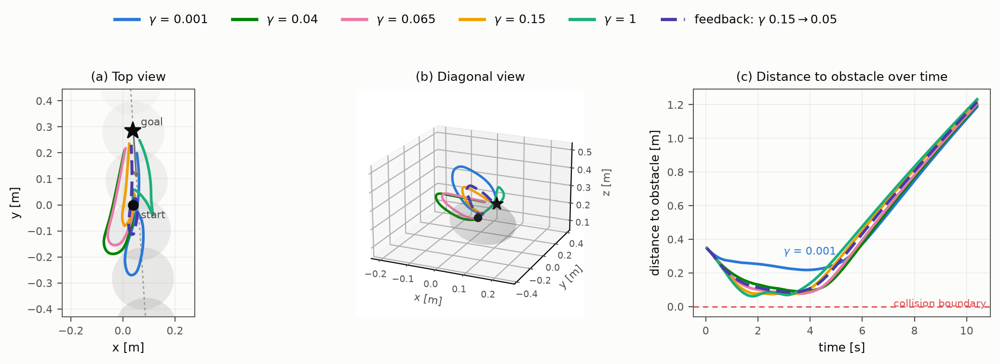
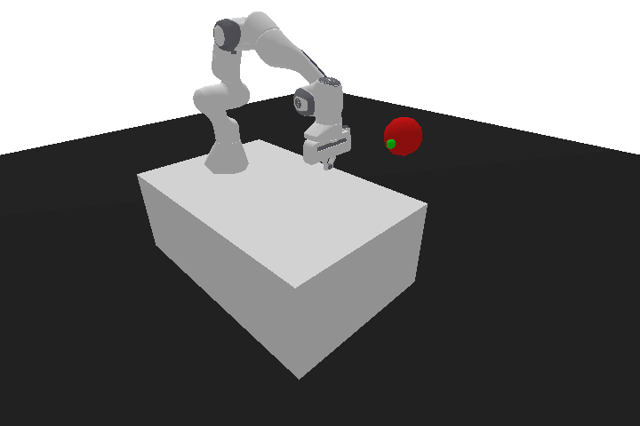
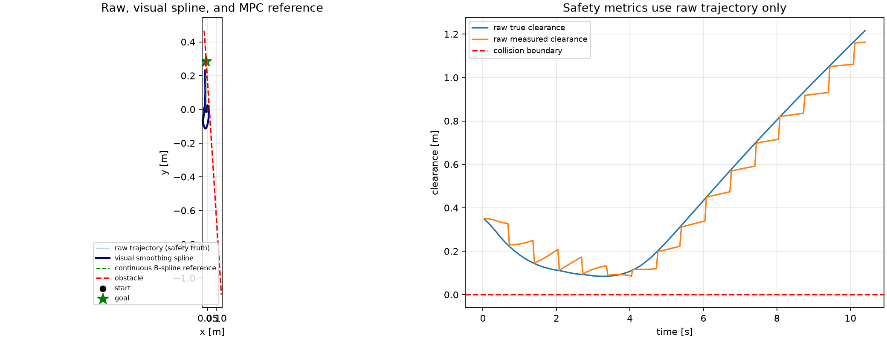

# Safety-Aware LaMPC-CBF Reproduction

[](https://github.com/OtisMcLeary-123/safety-aware-lampc-cbf-reproduction/actions/workflows/ci.yml)
[](pyproject.toml)
[](pyproject.toml)
[](pyproject.toml)
[](LICENSE)

Clean-room simulator reproduction and engineering extension of language-guided
model predictive control with control barrier functions (MPC-CBF) for Safe
Panda manipulation. The implementation separates the controller, symbolic CBF,
solver diagnostics, environment adapter, and experiment orchestration.

> This repository is not an exact Table-4 reproduction, a physical-robot
> result, or a whole-arm collision certificate.

## What Is Included

- 8-state double-integrator MPC-CBF controller with CasADi and do-mpc.
- Fail-closed IPOPT diagnostics and dynamic-obstacle sensing.
- Deterministic fixed-vs-feedback benchmark runners.
- Opt-in 3-D spline/waypoint avoidance and provider-feedback extensions.
- Unit and integration tests for the controller, CBF, solver, adapter, and
  benchmark contracts.

## Results

The primary committed result is the frozen 150-episode core benchmark
(three encounter families x 50 episodes, SHA-pinned instances, paired
designs; joint success = collision-free goal):

| Arm | Success | Collisions |
|---|---:|---:|
| Fixed hard-constraint baseline (static horizon) | 24/150 | 126 |
| + scripted gamma feedback | 24/150 | 126 |
| Velocity-tube prediction | 69/150 | 24 |
| + NIM gamma feedback (hard constraint) | 48/150 | 77 |
| Soft slack (L1 exact penalty, tube base) | 63/150 | 0 |
| + NIM gamma feedback (slack base) | 66/150 | 0 |
| Scripted prediction-channel feedback | 58/150 | 35 |
| Worst-case dead-time margin | 5/150 | 20 |

Scripted gamma feedback on the hard-constraint baseline changes no
outcome (150/150 concordant pairs); the same feedback on the tube base
is harmful (69 -> 48, collisions 24 -> 77, rejected-solve freeze); on
the slack base it is beneficial and confirmed by a preregistered
head-on experiment on 120 new instances: fixed `17/120` vs feedback
`30/120`, exact McNemar `p = 0.00098`, effect `+0.108`
(95% CI `[0.050, 0.167]`), zero collisions in all 240 episodes. The
sign of the feedback effect is decided by how the solver handles
infeasibility. See
[the 150-episode result](docs/SAFE_PANDA_CORE_SCENARIOS_150_RESULT.md).

The language-mapping stage has been probed with real GPT-4o
(`gpt-4o-2024-11-20` via GitHub Models) on the paper's eight published
calibration queries: blinded zero-shot prompting anti-correlates with
the printed mapping (Spearman `rho = -0.51`), few-shot prompting
recovers it (`rho = 0.95` with three constructed anchors; `rho = 1.00`,
8/8 labels, on leave-one-out replay of the published pairs), and a
paraphrase probe finds the mapped safety class phrasing-robust while
the continuous gamma is not (`0.01`-`0.05` across paraphrases of the
same warning). See
[the GPT-4o alignment probe](docs/GPT4O_ALIGNMENT_PROBE.md). The
benchmark's feedback decisions remain NIM llama-3.1-8b-instruct
checkpoint replays.

Earlier engineering extensions: the Safe Panda 8-state profile shows no
feedback effect (13/50 vs 13/50, McNemar `p=1.0`); the 3-D provider
extension reaches `23/50` vs `19/50` (McNemar `p=0.125`) and is not
evidence for the paper's GPT-4o/OpenAI success-rate claim. See
[the detailed 3-D result](docs/SAFE_PANDA_3D_PROVIDER_50_RESULT.md).

### Gamma-sweep illustration (head-on encounter, frozen instance CS1-E11)

One head-on episode from the frozen core benchmark, run under five fixed
gamma values plus the checkpointed language-feedback protocol, all on the
velocity-tube + soft-slack profile. On this instance every run —
including feedback — ends as a collision-free safety timeout: with the
obstacle riding the goal axis, the safe set along the direct route stays
empty. What gamma buys is clearance: smaller gamma deviates earlier and
holds a visibly wider margin, and the feedback run (gamma 0.15 to 0.05
at the frozen intervention time) recovers clearance over fixed 0.15
(73.6 mm to 84.3 mm). Illustrative, not a population-level ranking — see
[the 150-episode result](docs/SAFE_PANDA_CORE_SCENARIOS_150_RESULT.md).



| Run | Outcome | Steps | Minimum true clearance |
|---|---|---:|---:|
| `gamma=0.001` | Safety timeout | 260 | 217.4 mm |
| `gamma=0.040` | Safety timeout | 260 | 88.8 mm |
| `gamma=0.065` | Safety timeout | 260 | 76.6 mm |
| `gamma=0.150` | Safety timeout | 260 | 73.6 mm |
| `gamma=1.000` | Safety timeout | 260 | 61.3 mm |
| feedback `0.15→0.05` | Safety timeout | 260 | 84.3 mm |

### Feedback-arm episode render (head-on closure, frozen instance CS1-E11)

The same frozen head-on episode replayed under the NIM + soft-slack
feedback arm (gamma `0.15 -> 0.05` at the frozen intervention time,
cached provider decision, L1 slack valve on the velocity-tube base).
The arm ends the episode as a collision-free safety timeout: the
end-effector yields to the closing obstacle and holds clearance
(minimum `84.3 mm` over 260 steps) instead of forcing the goal. The
replay reproduces the committed benchmark row exactly, and the
animation draws the obstacle at its true instance radius
(`scripts/render_nim_slack_episode.py --obstacle-scale 1.0`).





## Installation

```bash
python3 -m venv .venv
source .venv/bin/activate
python -m pip install -e '.[dev,simulation]'
```

The optional `llm` extra is only needed for explicitly authorized provider
experiments. Saved local checkpoints can be replayed without provider access.

## Quickstart

Run the complete local test suite (currently `351 passed, 2 skipped`):

```bash
python -m pytest -q
```

Run the dry-run CLI (no solver or external API call):

```bash
lampc-cbf --gamma 0.15 --steps 1
```

Run the opt-in 3-D demo and save plots locally:

```bash
PYTHONPATH=src python scripts/run_3d_avoidance_demo.py \
  --reference-mode behind_spline \
  --goal-offset 0.00 0.30 0.00 \
  --obstacle-offset 0.00 0.15 0.06 \
  --obstacle-velocity 0.05 0.00 -0.015 \
  --route-offset 0.14 0.08 0.10 \
  --route-offset 0.14 0.23 0.10 \
  --position-q-weights 1.0 1.4 1.2 \
  --tangential-subgoal \
  --save-animation \
  --output-dir artifacts/3d_avoidance_demo
```

For experiment contracts and assumptions, start with
[Reproducibility](docs/REPRODUCIBILITY.md). The 3-D visualization profile is
documented in [3D Avoidance Demo](docs/3D_AVOIDANCE_DEMO.md).

## Edit the Three Core Scenarios

Launch the local Scenario Lab to inspect and edit the three planned scenario
families before generating the 150 resolved benchmark instances:

```bash
PYTHONPATH=src .venv/bin/python scripts/run_safe_panda_scenario_editor.py
```

For an actual PyBullet window with the Panda URDF, table, goal, obstacle,
trajectory guide, sliders, and direct x/y dragging, run:

```bash
PYTHONPATH=src .venv/bin/python scripts/run_safe_panda_3d_scenario_editor.py
```

The editor is browser-local, does not call a provider, and never overwrites the
authoritative manifest. See
[docs/SAFE_PANDA_SCENARIO_EDITOR.md](docs/SAFE_PANDA_SCENARIO_EDITOR.md) and
[docs/SAFE_PANDA_CORE_SCENARIO_PLAN.md](docs/SAFE_PANDA_CORE_SCENARIO_PLAN.md).

## Repository Layout

```text
configs/       versioned experiment and fidelity manifests
docs/          methods, results, reproducibility, and demo notes
scripts/       reproducible experiment entrypoints
src/lampc_cbf/ controller, CBF, solver, environment, and language modules
tests/         unit and integration tests
docs/assets/   small checked-in figures used by the README
```

Generated trajectories, provider records, credentials, virtual environments,
and source PDFs are intentionally excluded from the public tree. Aggregate
benchmark tables are retained only where explicitly documented by the
experiment contract.

## Scope and Limitations

- The 8-D benchmark is an engineering extension, not an exact paper recreation.
- The 3-D profile adds a custom route, obstacle geometry, and safety reflex.
- Provider context for the 3-D replay uses a nominal spline proxy because exact
  intervention-time state is unavailable before precollection.
- The CBF certifies analytical end-effector clearance, not whole-arm collision
  avoidance.

See [Reproducibility](docs/REPRODUCIBILITY.md) for source assumptions,
locked versions, and validation boundaries.

## License

The repository code is released under the [MIT License](LICENSE); external
dependencies and the source paper retain their own licenses and attribution
requirements.
