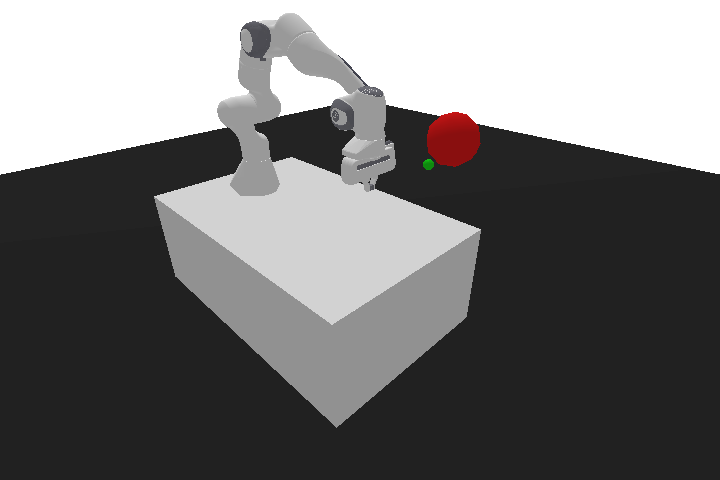
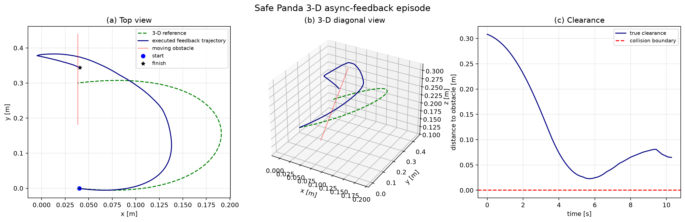

# Safety-Aware LaMPC-CBF Reproduction

[](tests/)
[](pyproject.toml)
[](pyproject.toml)
[](pyproject.toml)
[](docs/REPRODUCIBILITY.md)

Clean-room simulator reproduction and engineering extension of language-guided
MPC-CBF manipulation using Safe Panda Gym, do-mpc, CasADi, and IPOPT.

> This repository is not an exact Table-4 reproduction, a physical-robot
> result, or a whole-arm safety certificate.

## 3-D Async-Feedback Showcase

This replay uses successful async-feedback episode 1 from the 50-case 3-D
provider benchmark. The provider selected `gamma=0.03`; the controller reached
the goal without collision while avoiding a moving obstacle in `x`, `y`, and
`z`.





| Episode metric | Value |
|---|---:|
| Outcome | Goal |
| Collision | No |
| Feedback gamma | `0.03` |
| Provider latency | `0.548 s` |
| Minimum true clearance | `22.87 mm` |
| Raw `x` range | `-0.0049..0.1380 m` |
| Raw `z` range | `0.1990..0.3147 m` |

The raw trajectory, reference, obstacle trace, solver diagnostics, and complete
episode summary are stored in
`artifacts/safe_panda_3d_feedback_episode_01/`.

## Main Features

| Capability | Status |
|---|---|
| Safe Panda Gym adapter | Included |
| 8-state double-integrator MPC-CBF | Included |
| CasADi symbolic CBF constraints | Included |
| IPOPT fail-closed diagnostics | Included |
| Dynamic obstacle sensing and noise | Included |
| Fixed-vs-feedback paired benchmarks | Included |
| 3-D spline and waypoint avoidance profile | Opt-in |
| NVIDIA NIM contextual gamma replay | Explicitly authorized |
| Whole-arm collision certificate | Not provided |

## Results

### Primary 8-D benchmark

The committed baseline is the Safe Panda 8-state double-integrator extension:

| Method | Success | Collisions | Solver-failure steps |
|---|---:|---:|---:|
| Fixed `gamma=0.15` | 13/50 | 37/50 | 63 |
| Contextual feedback | 13/50 | 37/50 | 240 |

Paired success difference is `0.0` with exact McNemar `p=1.0`. This custom
simulator benchmark does not show an efficacy improvement from feedback.

### Opt-in 3-D provider extension

This separate engineering profile uses a 3-D B-spline, nonzero obstacle
height/vertical motion, tangential reflexes, and one NVIDIA NIM decision per
episode:

| Method | Success | Collisions | Mean minimum clearance |
|---|---:|---:|---:|
| Fixed `gamma=0.15` | 19/50 | 31/50 | 3.54 mm |
| Async provider feedback | 23/50 | 27/50 | 6.97 mm |

The paired difference is `+0.08`, but McNemar `p=0.125`; the difference is not
statistically significant at `alpha=0.05`. Details are in
[docs/SAFE_PANDA_3D_PROVIDER_50_RESULT.md](docs/SAFE_PANDA_3D_PROVIDER_50_RESULT.md).

## Installation

```bash
python3 -m venv .venv
source .venv/bin/activate
python -m pip install -e '.[dev,simulation]'
python -m pip install 'do-mpc[full]==5.1.1'
```

The full do-mpc extra provides ONNX, PyTorch, Jupyter, and OPC-UA integrations.
Provider features require an explicitly authorized local token and are never
needed for replaying a saved checkpoint.

## Quickstart

Run the local test suite:

```bash
PYTHONPATH=src pytest -q
```

Run one explicit 3-D avoidance demo and save its animation/plots:

```bash
PYTHONPATH=src python scripts/run_3d_avoidance_demo.py \
  --reference-mode behind_spline \
  --goal-offset 0.00 0.30 0.00 \
  --obstacle-offset 0.00 0.15 0.06 \
  --obstacle-velocity 0.05 0.00 -0.015 \
  --route-offset 0.14 0.08 0.10 \
  --route-offset 0.14 0.23 0.10 \
  --position-q-weights 1.0 1.4 1.2 \
  --tangential-subgoal \
  --save-animation \
  --output-dir artifacts/3d_avoidance_demo
```

Outputs include `metrics.json`, `robot_motion.gif`,
`raw_smoothed_and_safety.png`, and `trajectory_3d_comparison.png`.

## Reproduce the 50-Case 3-D Provider Extension

The provider collector resumes from its checkpoint and saves after each
accepted request:

```bash
PYTHONPATH=src python scripts/collect_safe_panda_3d_feedback.py \
  --request-interval-seconds 1.0

PYTHONPATH=src python scripts/run_safe_panda_3d_benchmark.py
```

To render a successful async-feedback episode with GIF and Figure-5-style
plots:

```bash
PYTHONPATH=src python scripts/render_safe_panda_3d_feedback_episode.py \
  --episode-id 1 \
  --output-dir artifacts/safe_panda_3d_feedback_episode_01
```

Provider decisions are model-substitution evidence (`meta/llama-3.1-8b-instruct`),
not GPT-4o/OpenAI evidence. Raw checkpoints and credentials remain local.

## Repository Structure

```text
configs/       versioned experiment and fidelity manifests
docs/          reproduction plans, protocols, result reports, and handoffs
scripts/       benchmark, provider, rendering, and replay entrypoints
src/lampc_cbf/ MPC-CBF, CBF, solver, Safe Panda, and language modules
tests/         unit and integration tests
artifacts/     local generated evidence (mostly ignored by Git)
```

Ownership boundaries and specialist responsibilities are documented in
[AGENTS.md](AGENTS.md). The package design separates the controller, symbolic
CBF, solver diagnostics, environment adapter, and integration orchestration.

## Reproducibility and Limitations

- The 8-D benchmark is an engineering extension, not an exact paper recreation.
- The 3-D profile is a custom route/reflex extension over the same deterministic
  scenario suite.
- Provider context for the 3-D replay is a nominal spline proxy because exact
  intervention-time state is unavailable before precollection.
- The CBF is an end-effector analytical clearance barrier; it is not a whole-arm
  collision certificate.
- Generated results, raw provider metadata, credentials, and virtual
  environments must not be committed.

See [docs/NEXT_THREAD_HANDOFF.md](docs/NEXT_THREAD_HANDOFF.md),
[docs/REPRODUCIBILITY.md](docs/REPRODUCIBILITY.md), and
[docs/3D_AVOIDANCE_DEMO.md](docs/3D_AVOIDANCE_DEMO.md) for the current handoff
and experiment contracts.

## Citation

This repository is a clean-room reproduction and extension. Cite the source
paper separately according to the paper manifest and cite this repository when
referencing the implementation, benchmark scripts, or generated analysis.

## License

See the project metadata and source-paper/license notes in
[docs/REPRODUCIBILITY.md](docs/REPRODUCIBILITY.md).
