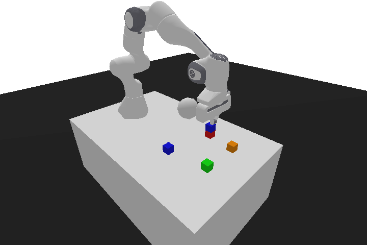
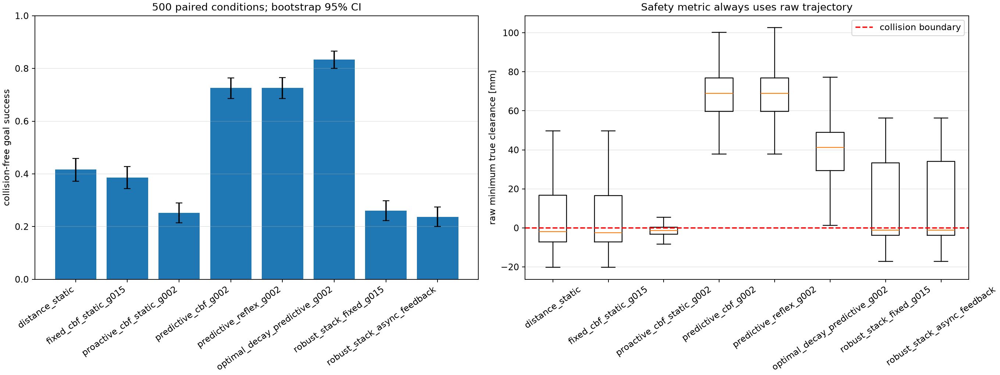
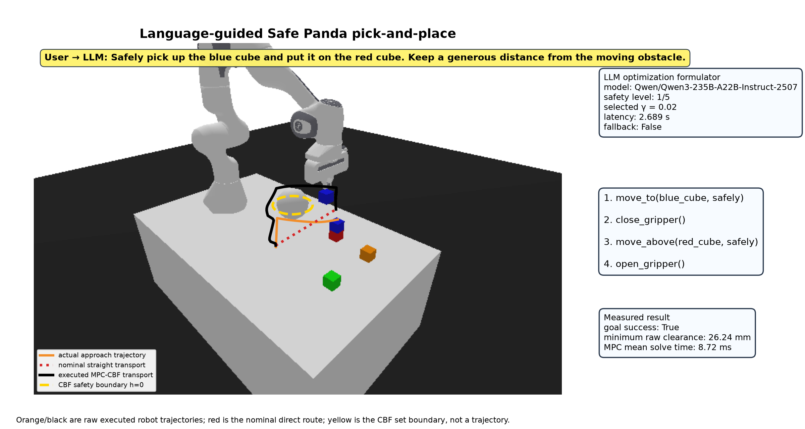
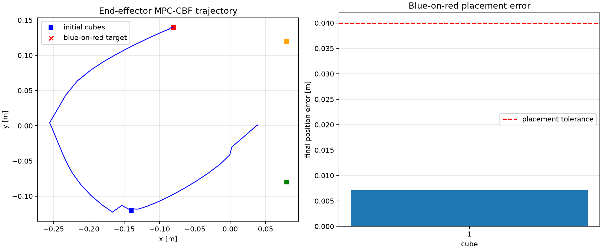
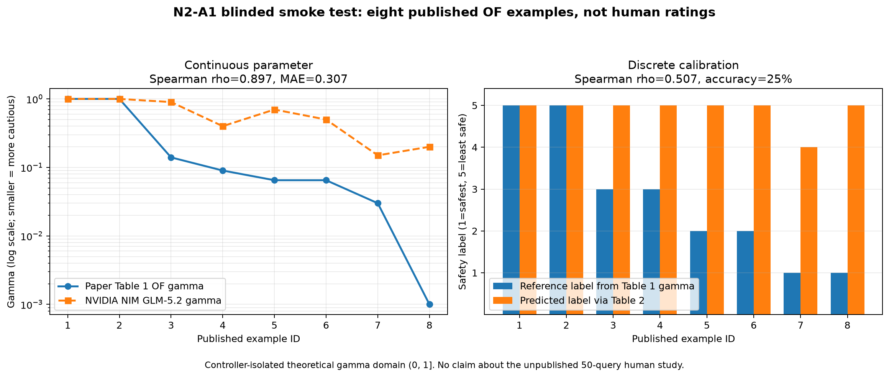
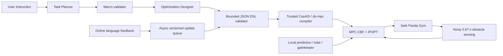

<div align="center">

# Safety-Aware LaMPC-CBF Reproduction

**A clean-room reproduction and stress test of language-guided MPC-CBF manipulation in Safe Panda Gym.**

[](pyproject.toml)
[](#controller-and-simulator)
[](https://github.com/OtisMcLeary-123/Safe-panda-gym)
[](#500-condition-paired-benchmark)
[](#reproducibility-boundary)

[Paper](https://doi.org/10.1109/ACCESS.2026.3664145) ·
[Current claim assessment](docs/CLAIM_REASSESSMENT_500.md) ·
[Language alignment](docs/LANGUAGE_ALIGNMENT_N2A1.md) ·
[Reproducibility boundary](docs/REPRODUCIBILITY.md)

</div>

<p align="center">
  
</p>

<p align="center"><em>Validated TP/OD output drives MPC-CBF pick-and-place in the reconstructed four-cube scene. The GIF is a deterministic simulator replay of recorded and locally revalidated model responses.</em></p>

> [!IMPORTANT]
> This repository is a **clean-room reconstruction**, not a bit-for-bit rerun of the authors' unpublished implementation. Results are simulator evidence, not a formal safety guarantee or physical-robot validation. Negative results are retained rather than tuned away.

## Results at a glance

The current evaluation covers paper-aligned baselines and deliberately stronger robustness extensions. All safety metrics use raw simulator positions; smoothed trajectories are visualization-only.

### 500-condition paired benchmark

Eight methods were evaluated on the same 500 randomized obstacle conditions, producing 4,000 paired Safe Panda Gym trials.

| Method | Goal success | Collisions | Mean minimum raw clearance | Main mechanism |
|---|---:|---:|---:|---|
| Distance, static obstacle | 208/500 (41.6%) | 292 | 4.86 mm | Distance constraint |
| Fixed CBF, `gamma=0.15` | 193/500 (38.6%) | 307 | 4.61 mm | Paper-style CBF baseline |
| Proactive CBF, `gamma=0.02` | 126/500 (25.2%) | 373 | 0.54 mm | Isolated gamma ablation |
| Predictive CBF, `gamma=0.02` | 363/500 (72.6%) | **0** | 69.71 mm | Velocity prediction + uncertainty tube |
| Predictive CBF + reflex | 363/500 (72.6%) | **0** | 69.74 mm | Adds local OS-CBF gatekeeper |
| Predictive optimal-decay | **417/500 (83.4%)** | 1 | 39.19 mm | Adds bounded decay optimization |
| Robust fixed stack, `gamma=0.15` | 130/500 (26.0%) | 316 | 10.26 mm | Feedback comparator |
| Robust asynchronous feedback | 118/500 (23.6%) | 316 | 10.83 mm | 168 atomic updates applied |

<p align="center">
  
</p>

The benchmark does **not** support a general claim that a smaller CBF parameter is automatically safer. In the isolated static comparison, `gamma=0.02` reduced success by 13.4 percentage points relative to `gamma=0.15` (paired 95% CI `[-17.8, -9.0]`). The strongest improvement came from obstacle-velocity prediction and uncertainty handling, not gamma alone. Full statistics, confidence intervals, timing failures, and the fallacy audit are reported in [the 500-condition claim reassessment](docs/CLAIM_REASSESSMENT_500.md).

### Language-guided pick-and-place

The end-to-end demonstration accepts a natural-language instruction, obtains a validated four-step Task Planner macro and two Optimization Designer specifications, and executes them through a trusted MPC-CBF controller.

| Metric | Result |
|---|---:|
| Task completed | Yes |
| Collision-free | Yes |
| Cubes placed | 1/1 |
| Blue-on-red placement error | 7.11 mm |
| Minimum raw physical obstacle clearance | 39.10 mm |
| Minimum raw margin outside active OD-CBF boundary | 1.10 mm |
| Mean / maximum MPC solve time | 8.08 / 16.31 ms |
| Accepted TP / OD fallbacks | 1 plan / 0 fallbacks |

<p align="center">
  
</p>

<p align="center">
  
</p>

The language model does not inject executable source into the controller. TP emits a validated action macro; OD emits bounded JSON for costs, limits, clearance, and `gamma`; trusted constructors compile the accepted specification. See the [pick-and-place experiment report](docs/LANGUAGE_GUIDED_PICK_PLACE.md).

### Language-to-gamma alignment

The paper reports alignment against 50 queries rated by five people. Those 50 queries and 250 individual ratings are not public, so this repository does not claim to reproduce that human study. A controller-isolated smoke test instead compares a blinded NVIDIA NIM GLM-5.2 run with the eight OF examples visible in the paper.

| Metric | Paper human study | Current 8-example smoke test |
|---|---:|---:|
| Spearman | 0.85 on discrete labels | 0.507 labels / **0.897 continuous gamma** |
| Kendall | 0.75 on discrete labels | 0.463 labels / **0.755 continuous gamma** |
| Pearson | 0.85 on discrete labels | 0.447 labels / 0.758 continuous gamma |
| Exact Table-2 label match | Not reported | **2/8 (25%)** |
| Continuous gamma MAE / RMSE | Not reported | 0.307 / 0.406 |

<p align="center">
  
</p>

The model recovers much of the semantic ordering but is poorly calibrated to the paper's absolute gamma scale. The continuous correlations are not interchangeable with the paper's human-label correlations. See the [N2-A1 alignment report](docs/LANGUAGE_ALIGNMENT_N2A1.md).

## Paper versus this reproduction

| Area | Paper | This repository | Status |
|---|---|---|---|
| Software stack | Python, do-mpc, CasADi, IPOPT, Safe Panda Gym | Same runtime stack with pinned versions | Reproduced |
| MPC model | 8-state, 4-input linear model; `dt=0.04 s`; horizon 15 | Same paper-aligned base model and timing | Reproduced |
| Obstacle sensing | 0.67 s zero-order hold; 0.005 m Gaussian noise | Same baseline sensor model | Reproduced |
| Discrete CBF | `Delta h >= -gamma h`, `0 < gamma <= 1` | CasADi expression inside do-mpc | Reproduced |
| Dynamic obstacle in horizon | Measured obstacle treated as static over the horizon | Baseline matches; advanced stack adds velocity prediction and a tube | Reproduced + extended |
| TP and OF | GPT-4o generates task and symbolic optimization formulation | Hosted models produce a strict JSON DSL compiled by trusted code | Partial, safer but less free-form |
| Proactive-gamma advantage | Smaller gamma produces earlier, wider avoidance in the shown scene | Strongly speed-dependent; aggregate claim not supported | Not reproduced generally |
| Online feedback | 44% to 78% success over 50 episodes | 26.0% to 23.6% over 500 paired conditions | Mechanism reproduced; benefit contradicted here |
| Language alignment | 50 queries and five reviewers | Eight published examples, no replacement human study | Not reproduced |
| Formal safety with noise/latency | Deterministic CBF argument plus simulation | Strong simulation evidence but deadline/model assumptions fail in some runs | Not formally verified |
| Physical Panda | Not evaluated | Not evaluated | Simulator-only |

The correct interpretation is: **the controller and integration pipeline are reproducible; the paper's strongest language-feedback claims are not yet reproduced.**

## System architecture



The LLM stays outside the 40 ms control loop. Invalid schemas, unknown objects, unsupported objectives or constraints, out-of-bounds parameters, infeasible solves, and missing diagnostics all fail closed.

## Controller and simulator

The paper-aligned controller uses

```math
h_k = \lVert p_k - p_{obs,k} \rVert_2^2 - (r_{obs} + r_{collision})^2
```

and enforces the discrete CBF condition

```math
h_{k+1} - h_k \ge -\gamma h_k, \qquad 0 < \gamma \le 1.
```

| Component | Reproduction setting |
|---|---|
| State / input | 8 states / 4 Cartesian-yaw inputs |
| Control period | 0.04 s |
| Prediction horizon | 15 steps (0.6 s) |
| Solver | IPOPT through CasADi and do-mpc |
| Simulator | Safe Panda Gym compatibility fork at a pinned commit |
| Paper-style sensing | 0.67 s ZOH with 0.005 m Gaussian position noise |
| Safety evaluation | Raw simulated poses only |

The [Safe Panda Gym compatibility fork](https://github.com/OtisMcLeary-123/Safe-panda-gym) restores the safe environments and ports the runtime API to Gymnasium/Python 3.12.

## Quick start

```bash
git clone https://github.com/OtisMcLeary-123/safety-aware-lampc-cbf-reproduction.git
cd safety-aware-lampc-cbf-reproduction

python3 -m venv .venv
source .venv/bin/activate
python -m pip install -e '.[dev,simulation]'
python -m pytest -q
```

### Replay the accepted language-guided demonstration

This path does not make another external model request:

```bash
PYTHONPATH=src python scripts/run_language_guided_pick_place.py \
  --replay-metrics artifacts/language_guided_pick_place/metrics.json
```

### Run the paper-style dynamic-obstacle experiment

```bash
PYTHONPATH=src python scripts/run_dynamic_obstacle_mpc_cbf.py
```

### Run the smoothness ablation

```bash
PYTHONPATH=src python scripts/run_smoothness_ablation.py
```

This compares waypoint switching with a continuous B-spline reference, `Delta u` weights 0.5, 1, 2, and 5, and an augmented-state `Delta^2 u` jerk cost. It reports path length, curvature, acceleration RMS, jerk RMS/max, raw safety clearance, and solve time.

### Run the paired safety benchmark

```bash
PYTHONPATH=src python scripts/run_paired_benchmark.py --episodes 500 --workers 4
```

### Run the collision-cone liveness ablation

This paired 20-episode workflow compares the existing memoryless collision
cone with side latching, a hard-screened policy library, and a same-side
tangential MPC subgoal. It keeps the 140-step budget fixed and uses raw
trajectory safety metrics.

```bash
PYTHONPATH=src python scripts/run_collision_cone_liveness_ablation.py \
  --episodes 20 --workers 4 --max-steps 140
```

The frozen variants and promotion gates are documented in the
[collision-cone liveness protocol](docs/COLLISION_CONE_LIVENESS_PROTOCOL.md).

The current paired result removed the four observed controller stalls without
increasing the timeout: `4/20 → 0/20`, with zero collisions in both conditions.
Interventions fell from 1,290 to 587 (`-54.5%`) and mean goal progress increased
from 77.3 mm to 198.8 mm. The target still had 17/20 safety timeouts and 383
explicit robust-recovery steps, so this is evidence of improved liveness—not a
formal robust-safety or task-completion claim.

An experimental Cartesian adaptation of `safe_control` DPCBF was also tested
after this gate passed. It failed the deterministic promotion grid with one
stall in four scenes and 47.1 mm lower mean progress than the selected C3BF
stack, so the DPCBF 20-episode run was not started. See the
[DPCBF ablation report](docs/DPCBF_ABLATION.md).

The subsequent development workflow derives an 8.785 s (`220` step) completion
budget from path length, a semicircular obstacle detour, and measured
sensing/feedback/recovery delays. It refuses to run unless the liveness
ablation gate passed:

```bash
PYTHONPATH=src python scripts/run_liveness_development.py \
  --episodes 100 --workers 4
```

The completed development run reached the goal in **82/100** episodes with
zero observed collisions and zero controller stalls. Eighteen episodes made
positive progress but exhausted the 220-step budget. Mean/worst raw clearance
was 56.6/27.5 mm; solver rejection and deadline-miss rates were 0.0848% and
0.0170%. The safety/timing gate passed, while 1,992 robust-recovery steps remain
an explicit limitation on any formal robust-safety claim. Full interpretation
is in the [collision-cone liveness protocol](docs/COLLISION_CONE_LIVENESS_PROTOCOL.md).

<details>
<summary><strong>Additional experiment commands</strong></summary>

```bash
# Deterministic MPC-CBF demo
python scripts/run_safe_panda_mpc_cbf.py --gamma 0.10

# Hard-scene paired study and representative visualizations
PYTHONPATH=src python scripts/run_hard_scene_study.py
PYTHONPATH=src python scripts/render_hard_scene_examples.py

# Sequential Build-L manipulation
python scripts/run_build_l_mpc_cbf.py --gamma 0.15

# Four-cube Build-L scene only
python scripts/render_build_l_scene.py
```

</details>

## Experiment index

| Experiment | Entry point | Report |
|---|---|---|
| Language-guided pick-and-place | `scripts/run_language_guided_pick_place.py` | [Results](docs/LANGUAGE_GUIDED_PICK_PLACE.md) |
| 500-condition paired benchmark | `scripts/run_paired_benchmark.py` | [Claim reassessment](docs/CLAIM_REASSESSMENT_500.md) |
| Proactive-CBF/feedback protocol v4 | `scripts/run_paired_benchmark.py --stage smoke` | [Protocol v4 and formal-scope audit](docs/PROACTIVE_CBF_ONLINE_FEEDBACK_PROTOCOL_V2.md) |
| Formal-safety/controller review | `scripts/run_paired_benchmark.py --stage smoke` | [Protocol-v4 smoke result](docs/FORMAL_SAFETY_CONTROLLER_CONFIRMATORY_V4.md) |
| Hard dynamic scene | `scripts/run_hard_scene_study.py` | [50-episode study](docs/HARD_SCENE_STUDY.md) |
| Language alignment | `scripts/run_nvidia_nim_alignment_smoke.py` | [N2-A1 report](docs/LANGUAGE_ALIGNMENT_N2A1.md) |
| Hugging Face/NIM integration | `scripts/run_hf_configured_mpc_cbf.py` | [LLM integration](docs/HF_LLM_INTEGRATION.md) |
| Smoothness and jerk ablation | `scripts/run_smoothness_ablation.py` | [Generated experiment result](artifacts/smoothness_ablation/EXPERIMENT_RESULT.md) |
| Dynamic obstacle MPC-CBF | `scripts/run_dynamic_obstacle_mpc_cbf.py` | [Generated experiment result](artifacts/dynamic_obstacle_mpc_cbf/gamma_0.10/EXPERIMENT_RESULT.md) |

## Reproducibility boundary

The official project repository does not publish the controller, prompts, experiment scripts, scene configuration, or raw numeric results. This implementation is reconstructed from equations (1)-(19), Algorithm 1, and the reported experimental setup.

Reported constants, mathematically derived values, and reproduction assumptions are kept separate. In particular:

- package versions are pinned here but were not reported in the paper;
- prompt text, object geometry, initial poses, target poses, and action mapping are reconstruction choices;
- the advanced prediction, uncertainty tube, gatekeeper, optimal decay, B-spline, and jerk-cost experiments extend beyond the paper baseline;
- zero observed collisions in a finite simulation sample is not a proof of forward invariance under unbounded noise, delayed actuation, missed solver deadlines, or whole-arm geometry;
- no result in this repository should be presented as physical-robot validation.

See [Reproducibility Notes](docs/REPRODUCIBILITY.md) and the [Clean-room Strategy](docs/CLEAN_ROOM_STRATEGY.md) for the full evidence policy.

## Reference

This repository reproduces and evaluates:

> S. Song et al., “Safety-Aware Optimal Control With Language-Guided Online Parameter Adjustment via Large Language Models,” *IEEE Access*, vol. 14, 2026, doi: [10.1109/ACCESS.2026.3664145](https://doi.org/10.1109/ACCESS.2026.3664145).

If you use this code or its generated evidence, cite the original paper and clearly label this repository as an independent clean-room reproduction.
