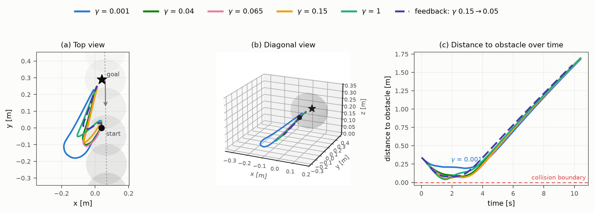
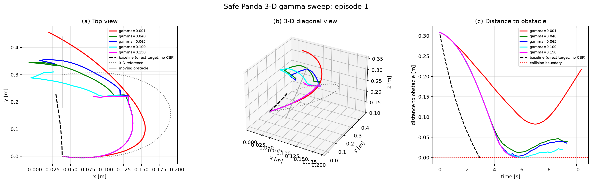

# Safety-Aware LaMPC-CBF Reproduction

[](https://github.com/OtisMcLeary-123/safety-aware-lampc-cbf-reproduction/actions/workflows/ci.yml)
[](pyproject.toml)
[](pyproject.toml)
[](pyproject.toml)
[](LICENSE)

Clean-room simulator reproduction and engineering extension of language-guided
model predictive control with control barrier functions (MPC-CBF) for Safe
Panda manipulation. The implementation separates the controller, symbolic CBF,
solver diagnostics, environment adapter, and experiment orchestration.

> This repository is not an exact Table-4 reproduction, a physical-robot
> result, or a whole-arm collision certificate.

## What Is Included

- 8-state double-integrator MPC-CBF controller with CasADi and do-mpc.
- Fail-closed IPOPT diagnostics and dynamic-obstacle sensing.
- Deterministic fixed-vs-feedback benchmark runners.
- Opt-in 3-D spline/waypoint avoidance and provider-feedback extensions.
- Unit and integration tests for the controller, CBF, solver, adapter, and
  benchmark contracts.

## Results

The primary committed result is the Safe Panda 8-state engineering extension:

| Method | Success | Collisions | Solver-failure steps |
|---|---:|---:|---:|
| Fixed `gamma=0.15` | 13/50 | 37/50 | 63 |
| Contextual feedback | 13/50 | 37/50 | 240 |

The paired success difference is `0.0` with exact McNemar `p=1.0`; this profile
does not show an efficacy improvement from feedback.

The separate 3-D provider extension reaches `23/50` successes versus `19/50`
for the fixed baseline, with McNemar `p=0.125`. It is an engineering extension,
not evidence for the paper's GPT-4o/OpenAI claim. See
[the detailed 3-D result](docs/SAFE_PANDA_3D_PROVIDER_50_RESULT.md).

### Gamma-sweep illustration (head-on encounter, frozen instance CS1-E00)

One head-on episode from the frozen core benchmark, run under five fixed
gamma values plus the checkpointed language-feedback protocol, all on the
velocity-tube + soft-slack profile. Smaller gamma buys a visibly wider
avoidance arc and larger clearance; every fixed gamma still times out on
this instance, while the feedback run (gamma 0.15 to 0.05 at the frozen
intervention time) is the only one that reaches the goal. Illustrative,
not a population-level ranking — see
[the 150-episode result](docs/SAFE_PANDA_CORE_SCENARIOS_150_RESULT.md).



| Run | Outcome | Steps | Minimum true clearance |
|---|---|---:|---:|
| `gamma=0.001` | Safety timeout | 260 | 193.4 mm |
| `gamma=0.040` | Safety timeout | 260 | 83.0 mm |
| `gamma=0.065` | Safety timeout | 260 | 67.5 mm |
| `gamma=0.150` | Safety timeout | 260 | 51.7 mm |
| `gamma=1.000` | Safety timeout | 260 | 41.9 mm |
| feedback `0.15→0.05` | **Goal** | 247 | 79.2 mm |

#### Legacy single-episode sweep (side-crossing, historical profile)


| Direct-target baseline, no CBF | Collision | 74 | -0.58 mm |

## Installation

```bash
python3 -m venv .venv
source .venv/bin/activate
python -m pip install -e '.[dev,simulation]'
```

The optional `llm` extra is only needed for explicitly authorized provider
experiments. Saved local checkpoints can be replayed without provider access.

## Quickstart

Run the complete local test suite:

```bash
python -m pytest -q
```

Run the dry-run CLI (no solver or external API call):

```bash
lampc-cbf --gamma 0.15 --steps 1
```

Run the opt-in 3-D demo and save plots locally:

```bash
PYTHONPATH=src python scripts/run_3d_avoidance_demo.py \
  --reference-mode behind_spline \
  --goal-offset 0.00 0.30 0.00 \
  --obstacle-offset 0.00 0.15 0.06 \
  --obstacle-velocity 0.05 0.00 -0.015 \
  --route-offset 0.14 0.08 0.10 \
  --route-offset 0.14 0.23 0.10 \
  --position-q-weights 1.0 1.4 1.2 \
  --tangential-subgoal \
  --save-animation \
  --output-dir artifacts/3d_avoidance_demo
```

For experiment contracts and assumptions, start with
[Reproducibility](docs/REPRODUCIBILITY.md). The 3-D visualization profile is
documented in [3D Avoidance Demo](docs/3D_AVOIDANCE_DEMO.md).

## Edit the Three Core Scenarios

Launch the local Scenario Lab to inspect and edit the three planned scenario
families before generating the 150 resolved benchmark instances:

```bash
PYTHONPATH=src .venv/bin/python scripts/run_safe_panda_scenario_editor.py
```

For an actual PyBullet window with the Panda URDF, table, goal, obstacle,
trajectory guide, sliders, and direct x/y dragging, run:

```bash
PYTHONPATH=src .venv/bin/python scripts/run_safe_panda_3d_scenario_editor.py
```

The editor is browser-local, does not call a provider, and never overwrites the
authoritative manifest. See
[docs/SAFE_PANDA_SCENARIO_EDITOR.md](docs/SAFE_PANDA_SCENARIO_EDITOR.md) and
[docs/SAFE_PANDA_CORE_SCENARIO_PLAN.md](docs/SAFE_PANDA_CORE_SCENARIO_PLAN.md).

## Repository Layout

```text
configs/       versioned experiment and fidelity manifests
docs/          methods, results, reproducibility, and demo notes
scripts/       reproducible experiment entrypoints
src/lampc_cbf/ controller, CBF, solver, environment, and language modules
tests/         unit and integration tests
docs/assets/   small checked-in figures used by the README
```

Generated trajectories, provider records, credentials, virtual environments,
and source PDFs are intentionally excluded from the public tree. Aggregate
benchmark tables are retained only where explicitly documented by the
experiment contract.

## Scope and Limitations

- The 8-D benchmark is an engineering extension, not an exact paper recreation.
- The 3-D profile adds a custom route, obstacle geometry, and safety reflex.
- Provider context for the 3-D replay uses a nominal spline proxy because exact
  intervention-time state is unavailable before precollection.
- The CBF certifies analytical end-effector clearance, not whole-arm collision
  avoidance.

See [Reproducibility](docs/REPRODUCIBILITY.md) for source assumptions,
locked versions, and validation boundaries.

## License

The repository code is released under the [MIT License](LICENSE); external
dependencies and the source paper retain their own licenses and attribution
requirements.
