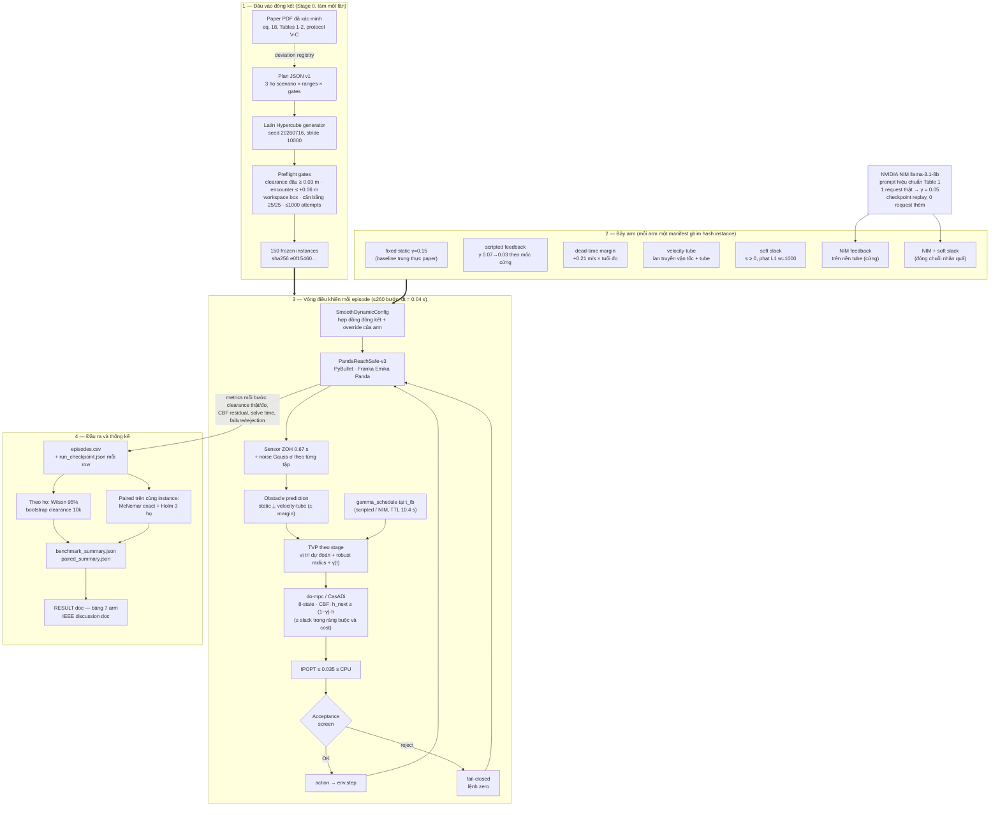

# Experiment Pipeline — Input to Output

Sơ đồ tách toàn bộ thí nghiệm 7-arm × 150-episode thành bốn tầng. Sức mạnh
của thiết kế nằm ở chỗ: **một bộ đầu vào đông kết duy nhất** chảy qua **bảy
cấu hình controller khác nhau**, nên mọi khác biệt ở đầu ra quy được về đúng
một nguyên nhân — cấu hình arm.

## Cách đọc theo dòng chảy nhân quả

| Tầng | Vai trò | Bất biến giữ chặt |
|---|---|---|
| 1 — Input | Sinh và đóng băng điều kiện thí nghiệm | Cùng 150 instance, cùng seed, hash khớp mọi nơi |
| 2 — Arms | Biến độc lập duy nhất của thí nghiệm | Manifest không được đụng khóa hợp đồng đông kết |
| 3 — Runner | Cỗ máy sinh dữ liệu, giống hệt cho mọi arm | Chỉ nhận khác biệt qua config; barrier không đổi |
| 4 — Output | Biến phụ thuộc + suy luận | Không gộp họ; paired trên đúng cặp episode |

## Ba "công tắc" tạo nên phát hiện chính (đều nằm ở tầng 3)

1. **PRED** static ⟂ velocity-tube — đòn bẩy an toàn lớn nhất (16% → 46%).
2. **FB** — tín hiệu siết γ, vô hại hay có hại tùy công tắc thứ ba.
3. **SCREEN → ZERO ⟂ MPC + slack** — chính nhánh "reject → zero" là cơ chế
   freeze biến feedback thành 77 va chạm; mở van slack (nhánh MPC hấp thụ
   violation) thì cùng tín hiệu FB cho 0 va chạm. Toàn bộ kết luận trung tâm
   của bài nằm ở việc bật/tắt đúng một cạnh này của sơ đồ.
